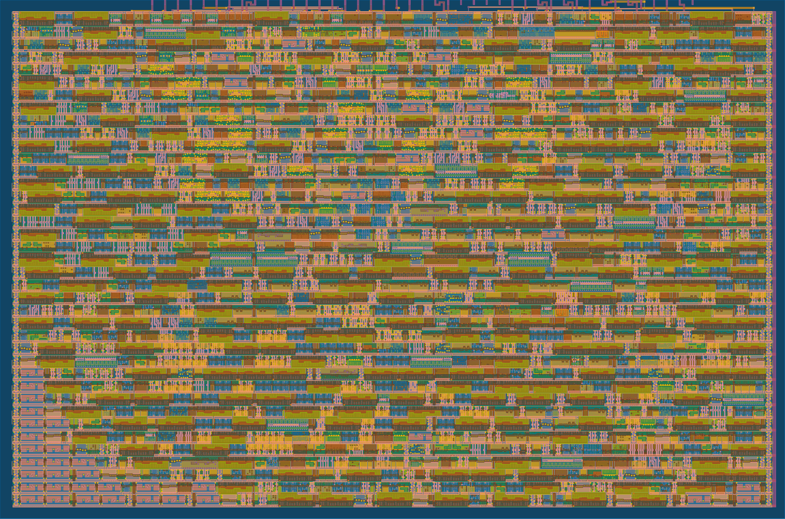

  

# ASIC for AY-3-8913 PSG in Verilog for Tiny Tapeout 5

<p align="center" width="100%">
    
</p>

# New silicon with **analog** DACs in CI2406

Visit: https://github.com/rejunity/tt07-psg-ay8913-with-analog-dac

# Modern replica of a classic AY-3-8913

This Verilog implementation is a replica of the classical **[AY-3-8913](https://en.wikipedia.org/wiki/General_Instrument_AY-3-8910)** programmable sound generator.
With roughly a 1600 logic gates this design fits on a **single tile** of the [TinyTapeout](https://www.tinytapeout.com).

The main goals of this project are:

1. closely replicate the behavior and eventually the complete **design of the original** AY-3-891x with builtin DACs
2. provide a readable and well documented code for educational and hardware **preservation** purposes
3. leverage the **modern fabrication** process

A significant effort was put into a thorough **test suite** for regression testing and validation against the original chip behavior.

# ASIC

The ASIC for the AY-3-8913 replica is built using the open source Skywater 130nm [PDK](https://github.com/google/skywater-pdk) and is part of multi project [TinyTapeout](https://www.tinytapeout.com).

Using 130nm process this AY-3-8913 fits in **160x100** um. The design consist of roughly **1600** digital logic gates and of which **223** are data flip-flops storing 1 bit of data each. Logic takes 87% of the chip area. Total wire length is **30 mm**!

<p align="center" width="100%">
    
</p>

Examine the layout of this chip in [3D](https://gds-viewer.tinytapeout.com/?model=https://rejunity.github.io/tt05-psg-ay8913/tinytapeout.gds.gltf)!


### Chip technical capabilities

- **3 square wave** tone generators
- **1 noise** generator
- **1 envelope** generator with 10 patterns
- Capable to produce a range of waves typically from **122 Hz** to **125 kHz**, defined by **12-bit** registers.
- **16** different volume levels

### Historical use of the AY-3-891x

The AY-3-891x family of programmable sound generators was introduced by General Instrument in 1978. Variants of the AY-3-891x were broadly used:

- home computers: Amstrad CPC, Atari ST, Oric-1, Sharp X1, MSX, ZX Spectrum 128/+2/+3
- game consoles: Intellivision, Vectrex
- and arcade machines

The AY-3-891x chip family competed with the similar [Texas Instruments SN76489](https://en.wikipedia.org/wiki/Texas_Instruments_SN76489).

### The reverse engineered AY-3-8910 / AY-3-8914

<p align="center" width="100%">
    
</p>

This implementation would not be possible without the reverse engineered [schematics and analysis](https://github.com/lvd2/ay-3-8910_reverse_engineered)
done by [**lvd**](http://github.com/lvd2) and based on decapped [AY-3-8910](https://siliconpr0n.org/map/gi/ay-3-8910) and [AY-3-8914](https://siliconpr0n.org/map/gi/ay-3-8914) chips!


### Info
* https://en.wikipedia.org/wiki/General_Instrument_AY-3-8910
* https://www.vgmpf.com/Wiki/index.php/AY-3-8910
* https://github.com/lvd2/ay-3-8910_reverse_engineered/blob/master/pdf/generalinstrument_ay-3-8910.pdf
* https://github.com/simondotm/ym2149f/blob/master/doc/Resources.md
* https://www.polynominal.com/atari-st/atari-st-ym2149f-yamaha.html
* https://www.atari-shrine.co.uk/hardware/articles/Yamaha%20YM2149.html
* http://wiki.intellivision.us/index.php?title=PSG
* https://www.atarimagazines.com/v4n7/stsound.html
* http://clarets.org/steve/projects/2021_ym2149_sync_square.html

### Compatible chips:
* YMZ294, YMZ284, YMZ285
* AY-3-8910, AY-3-8912, AY-3-8930
* YM2149
* YM3439
* T7766A
* WF19054, JFC 95101 and KC89C72
* https://maidavale.org/blog/ay-ym-differences/

### Computers that used AY-3-819x / YM2149
* Atari ST, Intellivsion, Amstrad CPC, Oric-1, Colour Genie, MSX, ZX Spectrum 128

### Reverse Engineering and chip decap images
* https://github.com/lvd2/ay-3-8910_reverse_engineered
* http://privatfrickler.de/blick-auf-den-chip-soundchip-general-instruments-ay-3-8910/
* https://siliconpr0n.org/map/gi/ay-3-8910/
* https://siliconpr0n.org/map/gi/ay-3-8914
* AY-3-8910 die size: 4.16 mm x 3.80 mm


### Connect chip to the speaker

There are several ways to connect this chip to the microcontroller and speaker.

One option is to connect off the shelf data parallel Digital to Analog Converter (DAC)
for example [Digilent R2R Pmod](https://digilent.com/reference/pmod/pmodr2r/start) to the output pins and
route the resulting analog audio to piezo speaker or amplifier.

Another option is to use the Pulse Width Modulated (PWM) AUDIO OUT pin with OpAmp+capacitor based integrator or capacitor based low-pass filter and a speaker:

```
  uController             AY-3-8913
  ,---------.            ,---._.---. 
  |         |    2 Mhz ->|CLK  SEL0|<-- 0
  |    GPIOx|----------->|BC1  SEL1|<-- 0
  |    GPIOx|----------->|BDIR     |
  |    GPIOx|----------->|D0       |
  |    GPIOx|----------->|D1       |
  |    GPIOx|----------->|D2       |          C1
  |    GPIOx|----------->|D3       |     ,----||----.
  |    GPIOx|----------->|D4       |     |          | 
  |    GPIOx|----------->|D5       |     |  OpAmp   |        Speaker     
  |    GPIOx|----------->|D6  AUDIO|     |   |\     |            /|
  |    GPIOx|----------->|D7   OUT |-----.---|-\    |   C2   .--/ |
  `---------'            `---------'         |  }---.---||---|    |
                                          ,--|+/             `--\ |
                                          |  |/               |  \|
                                          |                   |
                                     GND ---             GND ---  
```


### Externally configurable clock divider

| SEL1 | SEL0 | Description                        | Clock frequency|
|------|------|------------------------------------|----------------|
| 0    |    0 | Standard mode, clock divided by 8  | 1.7 .. 2.0 MHz |
| 1    |    1 |           -----//-----             | 1.7 .. 2.0 MHz |
| 0    |    1 | New mode for TT05, no clock divider| 250 .. 500 kHZ |
| 1    |    0 | New mode for TT05, clock div. 128  |  25 .. 50  MHz |


### Implementations
* https://github.com/jotego/jt49 (Verilog)
* https://github.com/dnotq/ym2149_audio/ (VHDL)
* https://opencores.org/projects/sqmusic
* https://github.com/mamedev/mame/blob/master/src/devices/sound/ay8910.cpp
* https://github.com/arnaud-carre/sndh-player/blob/main/AtariAudio/ym2149c.cpp
* https://github.com/mengstr/Discrete-AY-3-8910 - using only discreet 74-series logic ICs!

### Music playback!
* http://antarctica.no/stuff/atari/YM2/Misc.Games/ Music from several Atari ST games in YM format
* https://www.cpc-power.com/index.php?page=database Music from many Amstract CPC games in YM format
* https://vgmrips.net/packs/system/atari/st Music from AtariST games in VGM format
* https://vgmrips.net/packs/system/sinclair/zx-spectrum-128 Music from ZX Spectrum 128 games in VGM format
* https://vgmrips.net/packs/system/ascii/msx Music from MSX games in VGM format


# What is Tiny Tapeout?

TinyTapeout is an educational project that aims to make it easier and cheaper than ever to get your digital designs manufactured on a real chip.

To learn more and get started, visit https://tinytapeout.com.

### Verilog Projects

Edit the [info.yaml](info.yaml) and uncomment the `source_files` and `top_module` properties, and change the value of `language` to "Verilog". Add your Verilog files to the `src` folder, and list them in the `source_files` property.

The GitHub action will automatically build the ASIC files using [OpenLane](https://www.zerotoasiccourse.com/terminology/openlane/).

### How to enable the GitHub actions to build the ASIC files

Please see the instructions for:

- [Enabling GitHub Actions](https://tinytapeout.com/faq/#when-i-commit-my-change-the-gds-action-isnt-running)
- [Enabling GitHub Pages](https://tinytapeout.com/faq/#my-github-action-is-failing-on-the-pages-part)

### Resources

- [FAQ](https://tinytapeout.com/faq/)
- [Digital design lessons](https://tinytapeout.com/digital_design/)
- [Learn how semiconductors work](https://tinytapeout.com/siliwiz/)
- [Join the community](https://discord.gg/rPK2nSjxy8)

### What next?

- Submit your design to the next shuttle [on the website](https://tinytapeout.com/#submit-your-design). The closing date is **November 4th**.
- Edit this [README](README.md) and explain your design, how it works, and how to test it.
- Share your GDS on your social network of choice, tagging it #tinytapeout and linking Matt's profile:
  - LinkedIn [#tinytapeout](https://www.linkedin.com/search/results/content/?keywords=%23tinytapeout) [matt-venn](https://www.linkedin.com/in/matt-venn/)
  - Mastodon [#tinytapeout](https://chaos.social/tags/tinytapeout) [@matthewvenn](https://chaos.social/@matthewvenn)
  - Twitter [#tinytapeout](https://twitter.com/hashtag/tinytapeout?src=hashtag_click) [@matthewvenn](https://twitter.com/matthewvenn)
